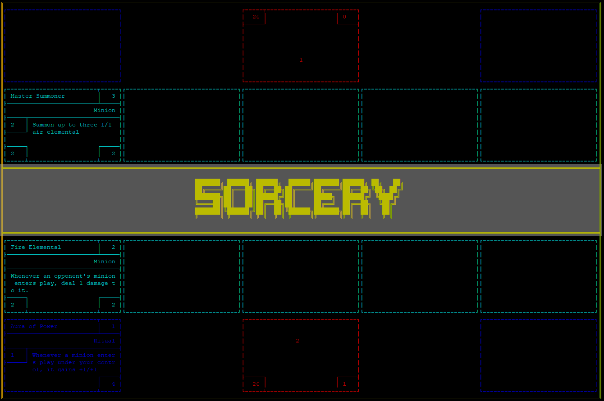

# Sorcery

C++ command line turn-based card game



## Getting Started

1. Run './main' to start the game

2. Enter first player's name and then second player's name

3. Start playing!

Use command 'help' to see all possible commands
```
Commands: help -- Display this message.
          end -- End the current player's turn
          quit -- End the game.
          attack minion other-minion -- Orders minion to attack other-minion.
          attack minion -- Orders minion to attack the opponent.
          play card [target-player target-card] -- Play card, optionally targeting target-card owned by target-player.
          use minion [target-player target-card] -- Use minion’s special ability, optionally targeting target-card owned by target-player.
          inspect minion -- View a minion’s card and all enchantments on that minion.
          hand -- Describe all cards in your hand.
          board -- Describe all cards on the board.
```
